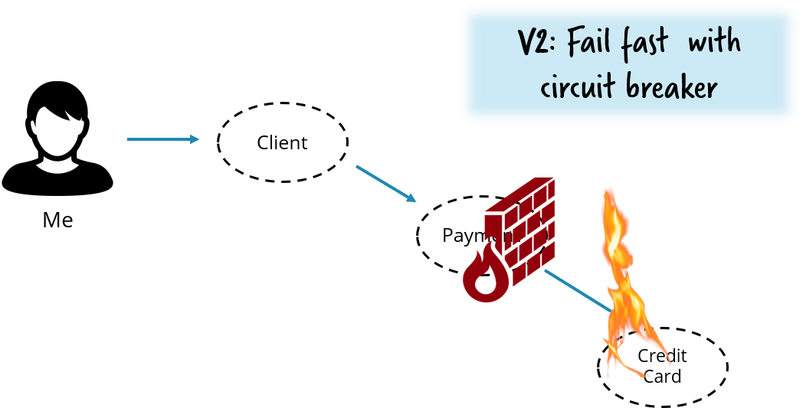
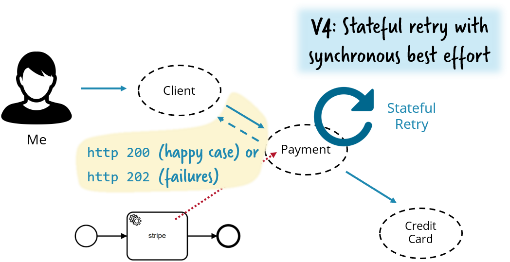
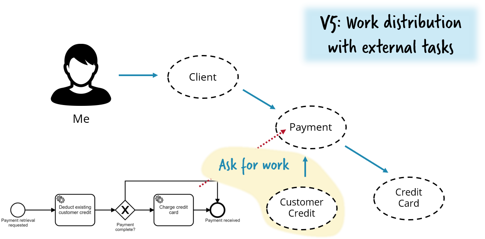
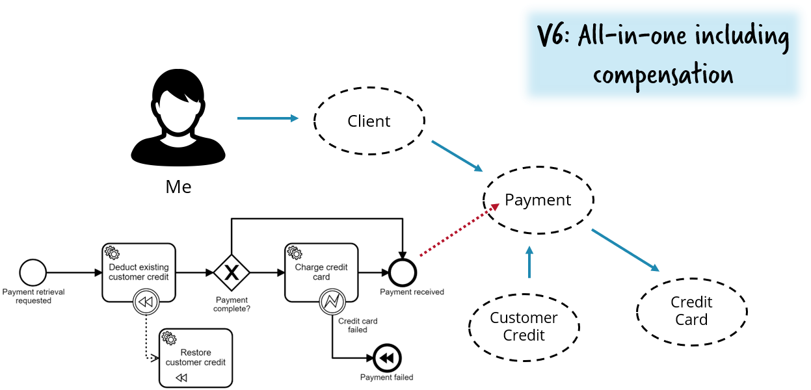

# Flowing Retail / REST

This folder contains services that connect via REST. Currently this is reduced to showcasing resilience patterns.

# Sample service demonstrating stateful resilience patterns in a REST environment

This sample (micro-)service can retrieve payments and therefor needs to be called via REST. It requires an upstream REST service to charge credit cards.


This simple call-chain is great to demonstrate various important resilience patterns.

There are two technology choices available for the code demos:

* [**Java**](java/payment) + Spring, Hystrix, Camunda
* [**C#**](csharp/payment) + Polly, Camunda


# Storyline

See **Fail fast is not enough**: https://blog.bernd-ruecker.com/fail-fast-is-not-enough-84645d6864d3

Assume the credit card service goes nuts, meaning it still responds, but very slow. Having no pattern in place this is the worst thing that can happen - as now the payment service will call the credit card service and block until he gets a response. As this take a long time all threads from the payment service are hold hostile and the payment service will eventually time out for its clients. Tiny failures somewhere in your system might blow up your whole system:


* Java: [PaymentRestHacksControllerV1.java](java/payment/src/main/java/io/flowing/retail/payment/port/resthacks/PaymentRestHacksControllerV1.java)
* C#: [PaymentControllerV1](csharp/payment/Controllers/PaymentController.cs#L16)

## Fail fast

The least you have to do is to apply a **fail fast** pattern like [**circuit breaker**](https://martinfowler.com/bliki/CircuitBreaker.html). In this example I use [Netflix Hystrix](https://github.com/Netflix/Hystrix). If a service responds to slow the circuit breaker interrupts and the payment service gets a failure right away. This way you make sure the overall system is still responding, even if functionality degrades (I cannot charge credit cards).



* Java: [PaymentRestHacksControllerV2.java](java/payment/src/main/java/io/flowing/retail/payment/port/resthacks/PaymentRestHacksControllerV2.java#L41)
* C#: [PaymentControllerV2](csharp/payment/Controllers/PaymentController.cs#L74)

## Fail fast is not enough

But failing fast is not enough. Very often a retry after the credit card service has been fixed resolves the situation. This retry needs to be stateful to not only retry right away but again in a couple of minutes, hours or even days. Having this stateful retrying as possibility keeps the failure handling local to payment making the whole architecture less complex.


In the example I use the [Camunda workflow engine](http://camunda.com/) to do the stateful retry reliably.

* Java
    * [PaymentRestHacksControllerV3.java](java/payment/src/main/java/io/flowing/retail/payment/port/resthacks/PaymentRestHacksControllerV3.java#L45)
    * The workflow is created by Java DSL
* C#
    * [PaymentControllerV3](csharp/payment/Controllers/PaymentController.cs#L110)
    * [PaymentV3.bpmn](csharp/payment/Models/PaymentV3.bpmn)

## Keep synchronous responses

The processing just got asynchronous, which is often not wanted. In this scenario you could very well return a synchronous response whenever the credit card service is available, but switch to asynchronicity only if it is not.



HTTP supports this by differntiating the return code (200 OK means all OK, 202 ACCEPTED means I call you back later).


* Java
    * [PaymentRestHacksControllerV4.java](java/payment/src/main/java/io/flowing/retail/payment/port/resthacks/PaymentRestHacksControllerV4.java#L83)
    * The workflow is created by Java DSL
* C#
    * [PaymentControllerV4](csharp/payment/Controllers/PaymentController.cs#L159).
    * [PaymentV4.bpmn](csharp/payment/Models/PaymentV4.bpmn)


## Asynchronous work distribution without messaging

An alternative to synchronously call an upstream service is to communicate asynchronously. The default would be messaging.

In this example I show one alternative which a lot of customers use very sucessfully: Using the workflow engine as work distribution, behaving like a queue. Therefor I leveraged a concept called [External Tasks](https://docs.camunda.org/manual/latest/user-guide/process-engine/external-tasks/).



* Java
    * Workflow model: [payment5.bpmn](java/payment/src/main/resources/payment5.bpmn) (hint: use the free [Camunda Modeler](https://camunda.com/download/modeler/) to show this model graphically)
    * Worker Node.js: [index.js](java/payment/node-customer-credit-worker/index.js)
    * Worker in Java (alternative): [CustomerCreditWorker.java](java/payment/src/main/java/io/flowing/retail/payment/worker/CustomerCreditWorker.java)
* C# (skipped V5 and directly implemented V6)
    * Workflow model:[PaymentV6.bpmn](csharp/payment/Models/PaymentV6.bpmn)
    * [PaymentControllerV6](csharp/payment/Controllers/PaymentController.cs#L74)


## Business transactions using compensation

The last part of the example adds compensation to the game. In distributed systems ACID transactions are not applicable (or at least do not scale well). Using compensation is the alternative - meaning that you reliably undo already executed work if something later on fails.



See [payment6.bpmn / Java](java/payment/src/main/resources/payment6.bpmn) and [PaymentV6.bpmn / C#](csharp/payment/Models/PaymentV6.bpmn) for the workflow


# How-to run

You have to startup both services:
* Stripe Fake Server
* Payment Service

This varies:
* [How to run in Java](java/payment)
* [How to run in .NET](csharp/payment)

Now the different versions of the payment service are available:

* http://localhost:8100/api/payment/v1
* ...
* http://localhost:8100/api/payment/v6

You now can issue a PUT with an empty body:

```
curl \
-H "Content-Type: application/json" \
-X PUT \
-d '{}' \
http://localhost:8100/api/payment/v1
```


## Hint on using Camunda Enterprise Edition

For Camunda there is an enterprise edition available with [https://camunda.com/products/cockpit/#/features](additional features in Cockpit) (the monitoring tool). It is quite handy to use this when playing around with the example. You can easily switch to use enterprise edition:

* Get a trial license if you don't have a license yet: https://camunda.com/download/enterprise/
* Java: Adjust Camunda version used in pom: [./pom.xml#L12](./pom.xml#L12), [./pom.xml#L50](./pom.xml#L50)
* .NET: Download the Camunda enterprise version

Note that you do not need the enterprise edition to run the examples, the community edition will also do fine. But because of less features you do not see historical workflow instances - and that means you do not see that much in Camunda Cockpit if everything runs smoothly.
